<div align="center">




<p align="center">
  
</p>

<p align="center">
  
  
  <a href="https://linkedin.com/in/surya-t-5b4908363/"></a>
</p>

</div>


## About Me

I'm a Computer Science Engineering student (**9.06/10 CGPA**) at Easwari Engineering College, also pursuing a **BS in Data Science and Applications at IIT Madras**. I build full-stack products across blockchain, AI, and backend systems — then dig into every line of them until I can defend it in an interview.

Recognized as a **Top 5% performer nationwide** in NPTEL's Blockchain and Its Applications. Four internships deep across Java backend development, sustainability tech, UI/UX design, and secure web systems — and currently deep in an AI internship with Infosys Springboard.

```yaml
Focus Areas:      FinTech, Digital Trust Systems, Blockchain Engineering, AI Products
Currently Ongoing: AI Intern (Batch 1) — Infosys Springboard Virtual Internship 7.0
Building Right Now: LiteraAI (Akshar) — AI-powered multilingual literacy platform
Open To:           Internships, collaborations, and interesting backend/AI problems
```


## Currently Building

<table>
<tr>
<td width="100%">

### &#9733; LiteraAI (Akshar) — AI-Powered Multilingual Literacy Platform
**Status:** `Actively in development` &nbsp;|&nbsp; **Context:** Core project for the Infosys Springboard AI Internship (Batch 1)

A foundational literacy learning platform combining a Flask/SQLite backend with AI-driven voice assessment, built to support learners across **6 regional Indian languages**. Ships with a two-step authentication flow — language selection followed by login/register — with inline validation and language-aware auto-population.

`Flask` `SQLite` `Python` `Multilingual NLP` `Voice Assessment`

</td>
</tr>
</table>


## Tech Stack

<table align="center">
<tr>
<td width="25%" align="center">

**Languages**


<br/>


<br/>


</td>
<td width="25%" align="center">

**Backend**


<br/>


<br/>


</td>
<td width="25%" align="center">

**Frontend & Data**


<br/>


<br/>


</td>
<td width="25%" align="center">

**Blockchain, AI & Tools**


<br/>


<br/>


</td>
</tr>
</table>


## Featured Projects

<table>
<tr>
<td width="50%" valign="top">

### &#128274; TrustChain
**Blockchain-based digital provenance platform**

6-layer AI tamper-detection engine (PDF forensics, EXIF analysis, Shannon entropy), Merkle root computation, dual hashing, atomic disk writes, and a Flask/FastAPI REST API with 5 endpoints plus a web dashboard.

`Python` `FastAPI` `Pydantic` `Blockchain` `SHA-256` `Proof-of-Work` `Swagger/OpenAPI`

[](https://github.com/SURYATSG786)

</td>
<td width="50%" valign="top">

### &#128218; LiteraAI (Akshar)
**AI-powered multilingual literacy platform** &nbsp;`In Progress`

Foundational literacy learning platform with AI-driven voice assessment, supporting 6 regional Indian languages, built during the Infosys Springboard AI Internship.

`Flask` `SQLite` `Python` `Multilingual NLP` `Voice Assessment`

[](https://github.com/SURYATSG786)

</td>
</tr>
<tr>
<td width="50%" valign="top">

### &#129513; TabLoom
**AI Chrome extension for intelligent tab management** &nbsp;`Elevate 2026 Hackathon`

Semantic AI clustering of browser tabs by intent, adaptive hibernation reclaiming up to 120MB RAM per idle tab, and a privacy-first architecture with local-only key storage.

`React` `TypeScript` `Vite` `Chrome APIs` `OpenRouter API`

[](https://github.com/sushanth-kumar-prog/Loom)

</td>
<td width="50%" valign="top">

### &#128230; Warehouse & Inventory Management System
**SQL-based inventory management system**

Built for the Elevate Labs internship — schema design, stock tracking, and reporting workflows on a relational SQL backend.

`SQL` `Database Design` `Backend Engineering`

[](https://github.com/SURYATSG786)

</td>
</tr>
</table>

<details>
<summary><strong>More projects</strong></summary>
<br/>

| Project | Stack | Highlights |
|---|---|---|
| **Online Banking Transaction Management System** | Java, SQL, OOP | Authentication, transaction logging, balance management |
| **Green Map Hub** | React, TypeScript, Vite, Tableau | Sustainability data visualization dashboards |
| **User Access Storage System** | HTML, CSS, JavaScript | Authentication and access control workflows |
| **Task Management Application** | Figma | Dashboard, Kanban board, calendar, messaging UI/UX |
| **Cryptocurrency Trading Simulator** | Java, Java Swing, OOP | Portfolio tracking and buy/sell simulation |

</details>


## GitHub Stats

<div align="center">


</div>

<div align="center">

</div>


## Certifications & Achievements

<table align="center">
<tr>
<th>Certification</th>
<th>Result</th>
</tr>
<tr><td>NPTEL Blockchain and Its Applications</td><td><strong>Elite Silver — Top 5% Nationwide</strong></td></tr>
<tr><td>NPTEL Introduction to Industry 4.0 and IoT</td><td><strong>Elite Silver</strong></td></tr>
<tr><td>NPTEL Design and Implementation of Human-Computer Interfaces</td><td><strong>Elite</strong></td></tr>
<tr><td>AWS Cloud Quest</td><td>Training Badges</td></tr>
<tr><td>Cisco Python Certification</td><td>Completed</td></tr>
<tr><td>MongoDB Certification</td><td>Completed</td></tr>
<tr><td>Infosys Springboard Java Certification</td><td>Completed</td></tr>
<tr><td>Python Full Stack Development Certification</td><td>Completed</td></tr>
</table>


## Internship Journey

```
Navodita Infotech        → Java Developer Intern         → Online Banking Transaction System
1M1B Green Skills Academy → Green Skills Intern           → Green Map Hub
Amdocs Technologies       → UI/UX Design Intern           → Task Management Application (Figma)
Cognifyz Technologies     → Web Development Intern        → User Access Storage System
Infosys Springboard       → AI Intern (Batch 1)           → LiteraAI (Akshar) — ongoing now
```


<div align="center">


### Let's Connect

<a href="https://linkedin.com/in/surya-t-5b4908363/"></a>
<a href="https://github.com/SURYATSG786"></a>

<sub>Thanks for stopping by — star a repo if something here was useful.</sub>

</div>
